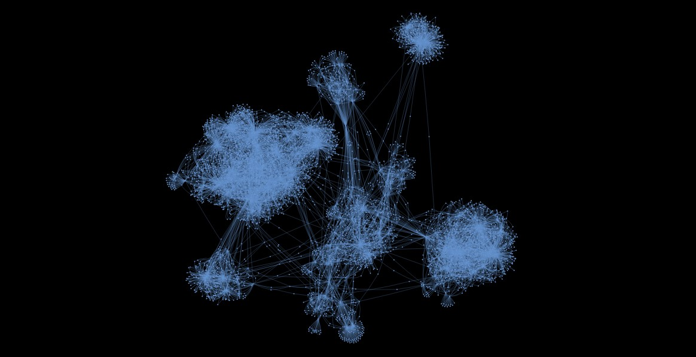

# Граф друзей в ВКонтакте

Граф строится на основе ID пользоватлей, хранящиеся в файле group_ids.json. В результате выпоолнения программы, добавляются два файла:
- friends_output.json - Содержит метаинформацию о выше указанных пользователях, а также его друзьях (id, имя, фамилию). Пользователь будет добавлен, в случае если его аккаунт является пубичным.
- friends_graph.html - файл визуализации графа.

## Граф:

|Количество узлов|Количество ребер|
 |- |--------|
| 60697| 68739 |

## Реузультаты вычисления центральностей для изначальных участников группы:

|Участник|Центральность по близости|Центральность по посреднечеству|Центральность по собственному вектору|
 |- |--------|--------|--------|
| Руся Яминов| 0.2456 | 0.0641 | 5.823 × 10^-6 |
| Артём Чистяков| 0.2725 | 0.2441 | 9.704 × 10^-5 |
| Кирилл Кравцов| 0.2635 | 0.1235 | 0.0153 |
| Маша Лавренченко| 0.2420 | 0.0708 | 1.167 × 10^-5 |
| Владислав Свинаренко| 0.2455 | 0.09 | 8.4322 × 10^-6 |